# Laravel Form Components Library

A collection of pre-made simple Laravel Blade form components.

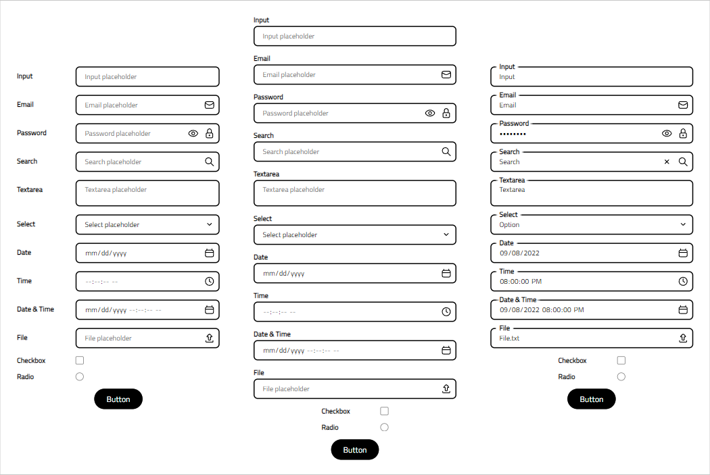

## Installation & setup

You can install the package via composer:

    composer require bjnstnkvc/form-components

The package will automatically register its service provider.

## Usage

### Config

Publish the components' config file with:

    php artisan vendor:publish --provider="Bjnstnkvc\FormComponents\FormComponentsServiceProvider" --tag=form-config

This will publish a file called ```form_components.php``` in your config-directory.

### Resources

Publish the components' resources files with:

    php artisan vendor:publish --provider="Bjnstnkvc\FormComponents\FormComponentsServiceProvider" --tag=form-resources

This will publish a following files to a folder configured in ```form_components.php```. By default, that folders
is `public/vendor/laravel-form-components`.

1. *form-components.css*
2. *form-components.min.css*
3. *form-components.js*
4. *form-components.min.js*

### Directives

Once config and resources have been published, add following Blade directives to your layout file.

    @componentsStyles

    @componentsScripts

As the name of the directives suggests, these will add Form components minified CSS and JS files. In case you would like
to edit published resource files, but would not like to edit minified versions, you can use the following syntax:

    @componentsStyles('full')

    @componentsScripts('full')

Directives above will instruct the library to load unminified css and js files, which you can edit as you see fit.

### .env

Add following properties to your `.env` file.

    COMPONENT_PREFIX=form
    COMPONENT_SEPARATOR=::
    COMPONENT_LABEL=floating
    COMPONENT_RADIUS=rounded-s
    COMPONENT_POSITION=center
    BUTTON_RADIUS=rounded
    INVALIDATED_TITLE=false
    INTERACTIVE_COMPONENT=true
    AUTOEXPAND_TEXTAREA=false

Detailed explanation for each property can be found [here](#customisation).

### Form Components

In order to use the Form components, use standard Blade Component syntax from the docs. By the default, the Form
components can be used with the `form` prefix.
Form components are using attributes which dictate how the component will be rendered.

Following attributes are worth mentioning:

- **name** - Name of the component (required).
- **id** - ID of the component (when not provided the `name` will be used).
- **title** - Title of the component (when not provided the `name` will be used).
- **placeholder** - Placeholder of the component (when not provided the `name` will be used).
- **value** - Value of the component, under the hood it makes use of the `old()` helper.
- **label** - Additional classes to be attached to the component label tag.
- **label-type** - Style in which the components are going to be displayed (by default, it's set to `column`).
- **border-radius** - Border radius of the component (by default, it's set to `rounded-s`).
- **invalidated-title** - Determine whether the Component title would change on invalid input (by default, set
  to `false`).
- **interactive** - Determine whether the validation errors should disappear on input (by default, set to `false`).

All other attributes wil be merged directly on to the HTML component element.

#### Input

```blade
<x-form::input name="input" placeholder="Input placeholder" />
```

Depending on the `label-type` choice, component will look as follows:

| label-type="column"                                                 | label-type="row"                                              | label-type="floating"                                                |
|---------------------------------------------------------------------|---------------------------------------------------------------|----------------------------------------------------------------------|
| 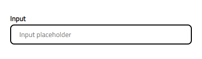 | 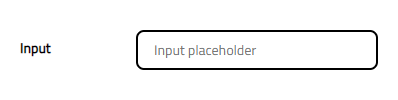 | 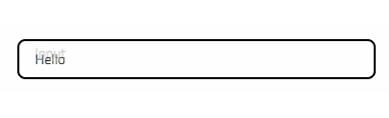 |

In case the field was not valid, depending on the `label-type` choice, component will look as follows:

| label-type="column"                                                          | label-type="row"                                                       |
|------------------------------------------------------------------------------|------------------------------------------------------------------------|
|  |  |

#### Password

```blade
<x-form::password name="password" placeholder="Password placeholder" />
```

Depending on the `label-type` choice, component will look as follows:

| label-type="column"                                                       | label-type="row"                                                    | label-type="floating"                                                      |
|---------------------------------------------------------------------------|---------------------------------------------------------------------|----------------------------------------------------------------------------|
| 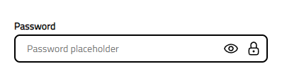 | 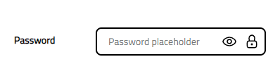 | 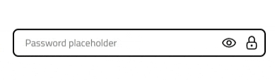 |

In case the field was not valid, depending on the `label-type` choice, component will look as follows:

| label-type="column"                                                                | label-type="row"                                                             |
|------------------------------------------------------------------------------------|------------------------------------------------------------------------------|
|  |  |

#### Textarea

```blade
<x-form::textarea name="textarea" placeholder="Textarea placeholder" />
```

Depending on the `label-type` choice, component will look as follows:

| label-type="column"                                                       | label-type="row"                                                    | label-type="floating"                                                      |
|---------------------------------------------------------------------------|---------------------------------------------------------------------|----------------------------------------------------------------------------|
| 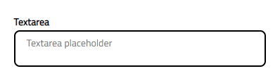 | 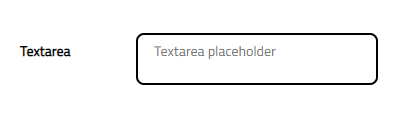 | 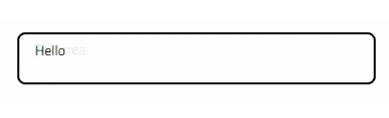 |

In case the field was not valid, depending on the `label-type` choice, component will look as follows:

| label-type="column"                                                                | label-type="row"                                                             |
|------------------------------------------------------------------------------------|------------------------------------------------------------------------------|
|  |  |

Textarea component comes with an option to auto-expand when typing which is by default turned off. In order to have it
enable, use the following syntax:

```blade
<x-form::textarea name="textarea" placeholder="Textarea placeholder" autoexpand="true" />
```

Depending on the `label-type` choice, component will display following behaviour:

| label-type="column"                                                                        | label-type="row"                                                                     |
|--------------------------------------------------------------------------------------------|--------------------------------------------------------------------------------------|
|  |  |

In case you wish auto expansion to be a default behaviour for all Textarea components, add `AUTOEXPAND_TEXTAREA=true` to
your `.env` file.

#### Select

```blade
<x-form::select name="select" />
```

The Select components accept `string` or an `array` as value from which it'll construct select options.

In order to pass values as a string, use the following syntax:

```blade
<x-form::select name="select" values="Option A, Option B" />
```

Above will generate the following options:

```html
<option value="option-a">Option A</option>
<option value="option-b">Option B</option>
```

In case you would like to pass option value as well as it's key, use the following syntax:

```blade
<x-form::select name="select" values="1: Option A, 2:Option B" />
```

Above will generate the following options:

```html
<option value="1">Option A</option>
<option value="2">Option B</option>
```

Same rules apply in case you are passing an `array`. For example, following PHP array:

```php
$options = ['Option A', 'Option B'];
```

and following blade component settings:

```blade
<x-form::select name="select" :values="$options" />
```

will generate the following options:

```html
<option value="0">Option A</option>
<option value="1">Option B</option>
```

> Note that due to the fact that an array was ***NOT*** passed as `key => value`, option value is starting from `0` and
> incrementing for each item.

In case an array has `key => value` pairs, following array:

```php
$options = [
    1 => 'Option A', 
    2 => 'Option B'
];
```

will generate following HTML:

```html
<option value="1">Option A</option>
<option value="2">Option B</option>
```

You can also pass whole `Eloquent Model` to the component. Let's say we have users table with the following data:

| id  | first_name | last_name | email                |
|-----|------------|-----------|----------------------|
| 1   | John       | Doe       | john.doe@example.com |
| 2   | Jane       | Doe       | jane.doe@example.com |

passed from the controller:

```php
return view('welcome', [
    'users' => User::all();
]);
```

In order to use it with Select component, following syntax is used:

```blade
<x-form::select name="select" :model="$users" model-key="id" model-value="first_name" />
```

As can be seen in an example above, in case Eloquent model has been passed, Select component expects three properties:

1. *:model* - Model passed from the controller or injected directly into the blade file.
2. *model-key* - Model key that will be used as an option value (when not provided the `id` will be used).
3. *model-value* - Model value from which option text will be generated.

This will generate following HTML:

```html
<option value="1">John</option>
<option value="2">Jane</option>
```

Same as with the other components, `placeholder` can be passed to the component which will generate placeholder option
value.

```blade
<x-form::select name="select" placeholder="Select a user" :model="$users" model-key="id" model-value="first_name" />
```

will generate following HTML:

```html
<option value="">Select a user</option>
<option value="1">John</option>
<option value="2">Jane</option>
```

In order to set default select value, you can use `default` property, which will pre-select the option on component
render. For example:

```blade
<x-form::select name="select" placeholder="Select a user" :model="$users" model-key="id" model-value="first_name" default="Jane" />
```

will generate following HTML:

```html
<option value="">Select a user</option>
<option value="1">John</option>
<option value="2" selected>Jane</option>
```

Depending on the `label-type` choice, component will look as follows:

| label-type="column"                                                   | label-type="row"                                                | label-type="floating"                                                  |
|-----------------------------------------------------------------------|-----------------------------------------------------------------|------------------------------------------------------------------------|
| 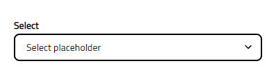 | 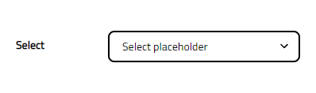 | 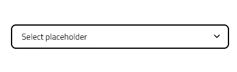 |

In case the field was not valid, depending on the `label-type` choice, component will look as follows:

| label-type="column"                                                            | label-type="row"                                                         |
|--------------------------------------------------------------------------------|--------------------------------------------------------------------------|
|  |  |

#### Date

```blade
<x-form::date name="date"/>
```

Depending on the `label-type` choice, component will look as follows:

| label-type="column"                                               | label-type="row"                                            | label-type="floating"                                              |
|-------------------------------------------------------------------|-------------------------------------------------------------|--------------------------------------------------------------------|
| 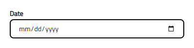 | 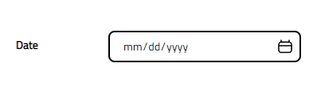 | 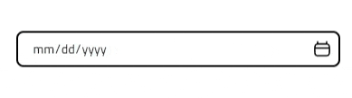 |

In case the field was not valid, depending on the `label-type` choice, component will look as follows:

| label-type="column"                                                        | label-type="row"                                                     |
|----------------------------------------------------------------------------|----------------------------------------------------------------------|
|  |  |

#### Time

```blade
<x-form::time name="time" />
```

Depending on the `label-type` choice, component will look as follows:

| label-type="column"                                               | label-type="row"                                            | label-type="floating"                                              |
|-------------------------------------------------------------------|-------------------------------------------------------------|--------------------------------------------------------------------|
| 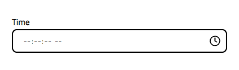 | 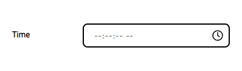 |  |

In case the field was not valid, depending on the `label-type` choice, component will look as follows:

| label-type="column"                                                        | label-type="row"                                                     |
|----------------------------------------------------------------------------|----------------------------------------------------------------------|
|  |  |

#### Date-Time

```blade
<x-form::date-time name="date & time" />
```

Depending on the `label-type` choice, component will look as follows:

| label-type="column"                                                       | label-type="row"                                                    | label-type="floating"                                                      |
|---------------------------------------------------------------------------|---------------------------------------------------------------------|----------------------------------------------------------------------------|
| 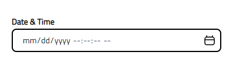 | 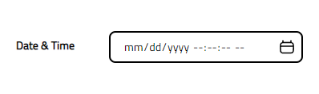 | 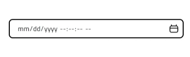 |

In case the field was not valid, depending on the `label-type` choice, component will look as follows:

| label-type="column"                                                                | label-type="row"                                                             |
|------------------------------------------------------------------------------------|------------------------------------------------------------------------------|
|  |  |

> Date, Time and Date-Time components utilize built-in HTML elements. Additionally, you can pass a value to all three
> fields which utilizes `Carbon` behind the scenes in order to parse the value prior to rendering the component.

#### File

```blade
<x-form::file name="file" placeholder="File placeholder" />
```

Depending on the `label-type` choice, component will look as follows:

| label-type="column"                                               | label-type="row"                                            | label-type="floating"                                              |
|-------------------------------------------------------------------|-------------------------------------------------------------|--------------------------------------------------------------------|
| 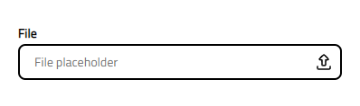 | 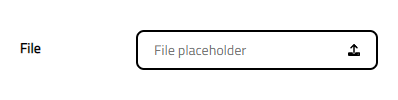 | 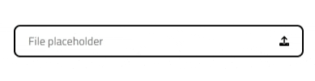 |

In case the field was not valid, depending on the `label-type` choice, component will look as follows:

| label-type="column"                                                        | label-type="row"                                                     |
|----------------------------------------------------------------------------|----------------------------------------------------------------------|
|  |  |

> File component utilize built-in HTML element.

### Checkboxes and Radio Buttons

#### Checkbox

```blade
<x-form::checkbox name="checkbox" />
```

Depending on the `position` choice, component will look as follows:

| position="left"                                                                | position="center"                                                                  |
|--------------------------------------------------------------------------------|------------------------------------------------------------------------------------|
|  |  |

In case the field was not valid, depending on the `position` choice, component will look as follows:

| position="left"                                                                              | position="center"                                                                                |
|----------------------------------------------------------------------------------------------|--------------------------------------------------------------------------------------------------|
|  |  |

#### Radio

```blade
<x-form::radio name="radio" />
```

Depending on the `position` choice, component will look as follows:

| position="left"                                                          | position="center"                                                            |
|--------------------------------------------------------------------------|------------------------------------------------------------------------------|
|  |  |

In case the field was not valid, depending on the `position` choice, component will look as follows:

| position="left"                                                                        | position="center"                                                                          |
|----------------------------------------------------------------------------------------|--------------------------------------------------------------------------------------------|
|  |  |

### Buttons

#### Button

In order to render a Button component, use the following syntax:

```blade
<x-form::button name="login" />
```

The component utilizes Laravel Slots, so in case you need to inject HTML into the button, use the following syntax:

```blade
<x-form::button> Button Content </x-form::button>
```

Additionally, in case you'd like the form button to actually be a link, all you need to do is add `link` property to the
component.

```blade
<x-form::button title="Login" link="login" />
```

Above property will render the component as an anchor tag.

Depending on the `border-radius` choice, component will look as follows:

| border-radius="squared"                                      | border-radius="rounded-s"                                                  | border-radius="rounded-m"                                                    | border-radius="rounded"                                      |
|--------------------------------------------------------------|----------------------------------------------------------------------------|------------------------------------------------------------------------------|--------------------------------------------------------------|
|  |  |  | 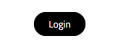 |

## Border

All components come with two different border styles, `full` and `bottom`. In order to change component border style,
add `border` property equal to one of the options listed above to your component of choice.
If you'd like to set a certain border style by default for all components, simply add **COMPONENT_BORDER**
property to your `.env` file.

Depending on the `label-type` choice, component will look as follows:

| label-type="column"                                               | label-type="row"                                            | label-type="floating"                                                 |
|-------------------------------------------------------------------|-------------------------------------------------------------|-----------------------------------------------------------------------|
| 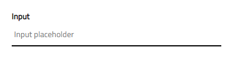 | 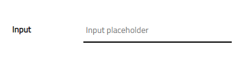 | 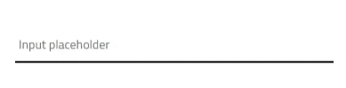 |


## Border Radius

All components come with three different border radius styles, `squared`, `rounded-s`, `rounded`. In order to change component border radius style,
add `border-radius` property equal to one of the options listed above to your component of choice.
If you'd like to set a certain border radius style by default for all components, simply add **COMPONENT_RADIUS**
property to your `.env` file.

| border-radius="squared"                                                      | border-radius="rounded-s"                                                                  | border-radius="rounded"                                                      |
|------------------------------------------------------------------------------|--------------------------------------------------------------------------------------------|------------------------------------------------------------------------------|
|  |  |  |

## Invalidated Title

All components are shipped with an ability to highlight component title in case the filed was invalid. In order to turn this feature on,
add `invalidated-title="true"` to your component of choice.
If you'd like this feature to be turned on by default for all components, simply add **INVALIDATED_TITLE=true**
property to your `.env` file.

| label-type="column"                                                                           | label-type="row"                                                                        | label-type="floating"                                                                          |
|-----------------------------------------------------------------------------------------------|-----------------------------------------------------------------------------------------|------------------------------------------------------------------------------------------------|
|  |  |  |

## Interactivity
    
All components are shipped with an ability to remove validation errors on input. In order to turn this feature on,
add `interactive="true"` to your component of choice.
If you'd like this feature to be turned on by default for all components, simply add **INTERACTIVE_COMPONENT=true**
property to your `.env` file.


## Customisation

### Config

- **publish_path** - *Path used to publish component files.*


- **prefix** - *Form Components prefix, defaults to 'form' (E.g. <x-form-button>).*
    - Configurable via `.env` **COMPONENT_PREFIX** property.


- **separator** - *Form Components separator, defaults to '::' (E.g. <x-form::button>).*
    - Configurable via `.env` **COMPONENT_SEPARATOR** property.


- **label_type** - *Form Components label style, defaults to 'column' (options: column, row, floating).*
    - Configurable via `.env` **COMPONENT_LABEL** property.


- **component_radius** - *Form Components default border radius (options: squared, rounded-s, rounded).*
    - Configurable via `.env` **COMPONENT_RADIUS** property.


- **position** - *Form Components default checkbox/radio position, defaults to 'center' (options: left, center).*
    - Configurable via `.env` **COMPONENT_POSITION** property.


- **button_radius** - *Form Components default button radius (options: squared, rounded-s, rounded-m, rounded).*
    - Configurable via `.env` **BUTTON_RADIUS** property.


- **invalidated_title** - *Determine whether the Component title would change on invalid input.*
    - Configurable via `.env` **INVALIDATED_TITLE** property.


- **interactive** - *Determine whether the errors should disappear on input.*
    - Configurable via `.env` **INTERACTIVE_COMPONENT** property.


- **auto_expand** - *Determine whether the Text Area height should expand with input.*
    - Configurable via `.env` **AUTOEXPAND_TEXTAREA** property.

> **Note:** You might need to clear config cache using `php artisan cache:clear` command after you make changes to `.env`
 file.


### Publishing

You can publish all components class and view using artisan the following command:

    php artisan components:publish

Optionally, you can pass component name as an argument, which will publish only those components.

    php artisan components:publish Input Password Button

From this point on, you can change the published component class and view to your liking.

### Restoring

If by any chance you'd like to restore the components default settings, use the following artisan command:

    php artisan components:restore

Optionally, you can pass component name as an argument, which will restore only those components.

    php artisan components:restore Input Password Button

Additionally, if you'd like to remove previously published components class and views, you can attach `--delete` option:

    php artisan components:restore --delete

or

    php artisan components:restore Input Password Button --delete

## License

The MIT License (MIT). Please see [License File](LICENSE) for more information.
